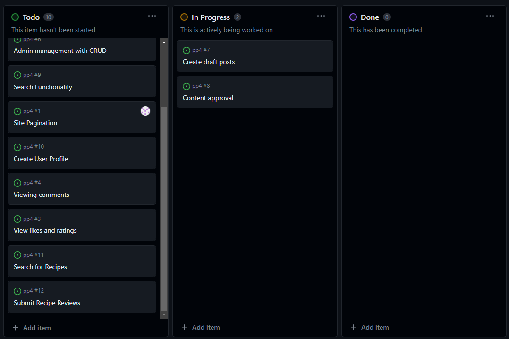
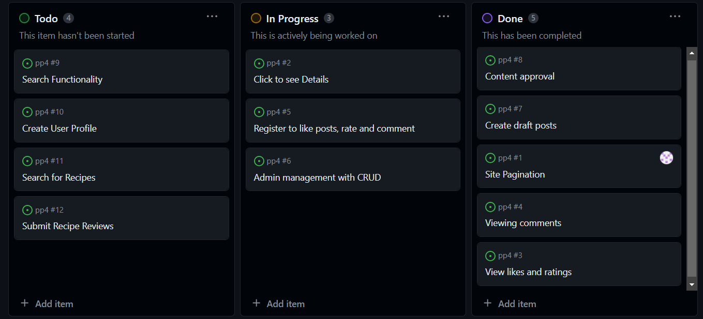
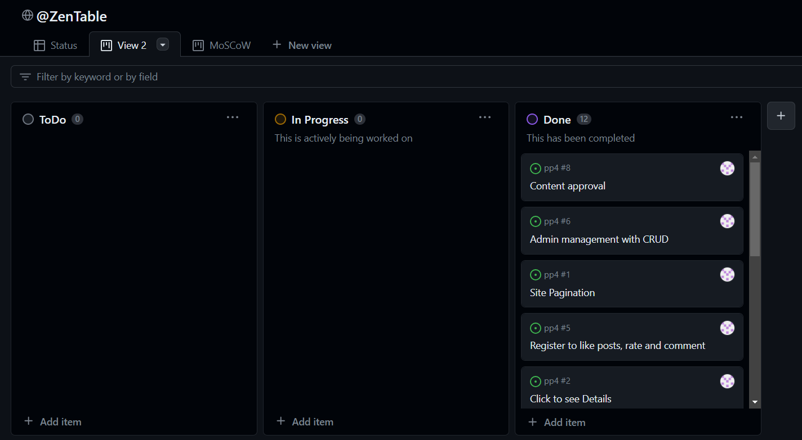
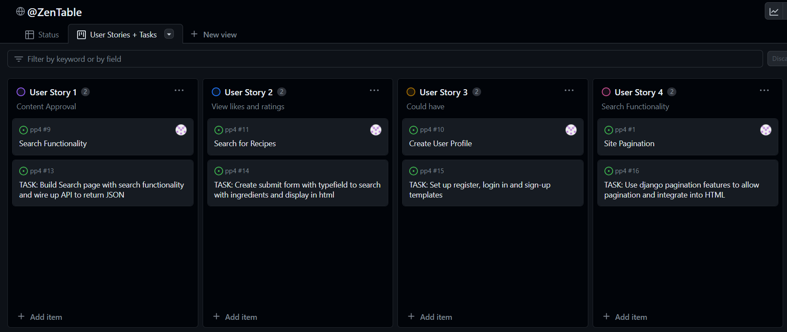

# Wasteless Table: Ingredient Search & Recipe Reviews

Wasteless Table is an online tool and blog that encourages users to avoid discarding food by utilizing what ingredients they already have in the kitchen. A search function provides recipes tailored to what ingredients the user has at hand. Users are invited to join and contribute to a community of people reviewing, sharing and updating recipes. 

Ireland is estimated to generate 1.1 million tonnes of food waste per year, according to the [Environmental Protection Agency](https://www.epa.ie/publications/circular-economy/resources/nature-and-extent-update-15th-June.pdf)

Live Website here: 

## Table of Contents
- Project Overview
- Process
    - Problem Statement
    - Research
    - Design
    - Development
        - Link to GitHub project board
        - User Stories
- Database
    - Reviews
    - Comments
    - Ingredients
    - Utensils
    - Cuisine Types
- Features
    - Crud Functionality
        - Add Review
        - Update Review
        - Delete Review
        - Add Comment
        - Edit Comment
        - Delete Comment
    - Authentication & Authorisation
    - Navigation
    - Recipe Search
    - Recipe Blog
    - About
    - Defensive Design
- Roadmap
- Bugs
- Technologies Used
    - Core Development Technologies
    - Libraries, Frameworks and Packages
    - Python & Django Packages
    - Infrastructural Technologies
- Testing
- Deployment
    - Local Deployment
    - Heroku Deployment
    - Environment Variables
- Credits

### User Experience

## User Stories

- As a site user, I can search for so that I can find a recipe to eat.
- As a site user, I can search with ingredients, tag names or cuisine types so that I can find a list of recipes.

I implemented a search functionality on my website that allows users to search for recipes using a list of ingredients. The search also returns recipes based on cuisine type or dish name. A used who has reviewed the ingredients they have in their kitchen would want to input them one by one so the search functionality allows the inputs of tag names.

User Story 1 & 2

 

- As a site user I can see my user profile so that I can see my details.

I have not yet achieved this capability on the website. Users can sign-in, login and if authenticated, leave reviews and comments. CRUD functionality is implemented with a link to Update Review if the user is the author of the review. I considered a dashboard for the user of some kind to not be a minimal viable product so it was not my focus.

User Story 3

 

- As a site user I can view a list of paginated recipes so that select the recipe details.

I implemented pagination for the list of recipes to enhance user experience and page loading speed. Django's built-in pagination features to split the recipe list into manageable pages was used to do this.

User Story 4

 

- As a user I can submit recipe reviews so that the admin can add a recipe review to the blog.

I created a database model for storing recipe reviews, associating them with specific recipes and users. I used a form for users to submit reviews for recipes. This is initially not published. It is the admins task to review the entry before publishing.

User Story 4

 

- As a site user I can register an account so that I can leave a comment, rating and like.

I integrated Django's built-in authentication views and forms for user registration. Users can register with an account name and password. I have not yet given the user the ability to set up an account with an email. Users can be managed from the admin panel.

User Story 5

 

- As a Site User I can click on a recipe so that I can see the details.

I developed a detailed view for each recipe, allowing users to click and view comprehensive details. A URL routing mechanism was used to handle recipe-specific views. By clicking a recipe, the user is taken to the entire blog post containing the review and comment features.

User Story 6

 

- As a site administrator I can approve posts so that the blog is populated.

I used Django's admin interface to manage and approve recipe posts. I had to create custom admin views to maintain the posts. The admin has the ability to review the recipe, ingredients, utensils and images of the post before publishing.

User Story 7

 

- As a site administrator I can create, read, update and delete so that the blog's content can be managed.

I developed views and forms for creating, reading, updating, and deleting recipes. Appropriate access controls were used to ensure only authorized users can perform these actions.

User Story 8

 

- As a site administrator I can approve or disapprove comments and recipes so that I can filter content.

The approval system was extended to handle both comments and recipes. Similarly providing admin tools the functionality to easily approve or disapprove content.

User Story 9

 

- As a site user and administrator I can view the comments on a recipe so that see what is being talked about.
- As a site user and administrator I can view the rating and number of likes/upvotes on each recipe so that I can determine the best and popular ones.

Views were used to display comments associated with each recipe. The comments and user who wrote it is rendered in the template. Similarly the overall rating and number of likes/upvotes for each recipe was displayed for anybody to see..

User Story 10 & 11

 

The three screenshots below were taken at the start of development, the midway point and at the final stage. They show three columns - to do, in progress and completed. Only over the course of the few weeks developing the project did the lessons on Agile development begin to really make sense. In completing my own project, I recognised mistakes I had made in the planning process and how my development process had to completely change given the timeframe that the project needed to be completed in. The lessons on Agile development - and the entire point of the Agile manifesto - began to really make sense. 

Similarly, at the start of development, I never realised how useful of a tool GitHub projects/views could be.

Initial Agile Screenshot

 

Midway Agile Screenshot

 

Final Agile Screenshot

 

I initially had the prioritisation of what features I needed to implement written down. I was recommended to use GitHub projects for this too so using the User Stories I created a new board to help visualise what did and what did not need to be prioritised. 

MoSCoW Prioritisation Screenshot

 

Again, using GitHub projects to help maintain the direction of my project, I created another board with Tasks to help visualise what I needed to do to complete my user stories. 

Users & Tasks Screenshots 1

 

Users & Tasks Screenshots 2

 

Users & Tasks Screenshots 3

 

#### Process
- Problem Statement
- Research
- Design
- Development
- Data Models

### Features
- CRUD Functionality
- Authentication and Authorisation
- Navigation
- Recipe Search
- Add User
- Recipe Blog
- Add review
- Add comments
- About

### Roadmap

### Bugs

### Technologies Used
- Core Development Technologies
- Libraries, Frameworks and Packages
- Python/Django packages
- Infrastructural Technologies

### Testing

Full testing: [Testing.md](Testing.md)

### Deployment 

### Credits
