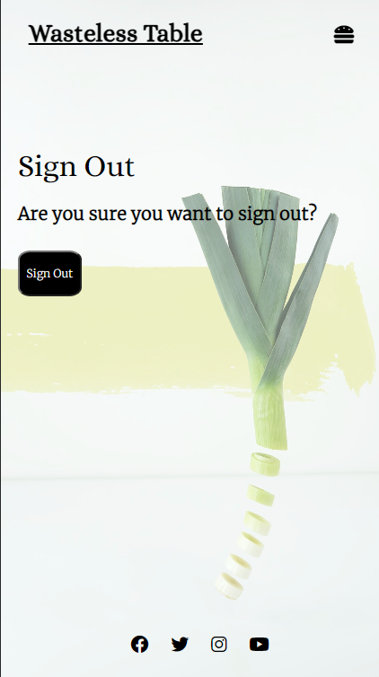
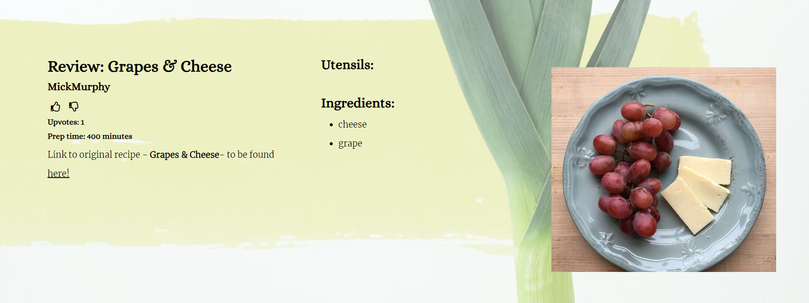

# Wasteless Table: Ingredient Search & Recipe Reviews

Wasteless Table is an online tool and blog that encourages users to avoid discarding food by utilizing what ingredients they already have in the kitchen. A search function provides recipes tailored to what ingredients the user has at hand. Users are invited to join and contribute to a community of people reviewing, sharing and updating recipes. 

Ireland is estimated to generate 1.1 million tonnes of food waste per year, according to the [Environmental Protection Agency](https://www.epa.ie/publications/circular-economy/resources/nature-and-extent-update-15th-June.pdf)

Live Website here: [Wasteless Table](https://portfolio-project-four-1f2f0bc1d6a0.herokuapp.com/)

## Table of Contents
- Project Overview
- Process
    - Problem Statement
    - Research
    - Design
    - Development
        - Link to GitHub project board
        - User Stories
- Database
    - Reviews
    - Comments
    - Ingredients
    - Utensils
    - Cuisine Types
- Features
    - Crud Functionality
        - Add Review
        - Update Review
        - Delete Review
        - Add Comment
        - Edit Comment
        - Delete Comment
    - Authentication & Authorisation
    - Navigation
    - Recipe Search
    - Recipe Blog
    - About
    - Defensive Design
- Roadmap
- Bugs
- Technologies Used
    - Core Development Technologies
    - Libraries, Frameworks and Packages
    - Python & Django Packages
    - Infrastructural Technologies
- Testing
- Deployment
    - Local Deployment
    - Heroku Deployment
    - Environment Variables
- Credits

## Process

### Concept

When researching Application Programming Interfaces (APIs), I chanced upon an interesting Recipe Search API provided by [EDAMAM](https://www.edamam.com/). The provider offers different APIs but the Recipe Search was useful in developing my idea as it could be the basis of where I retrieved recipes from for my blog. If offers 2.3 million different recipes, 500+ web resources and many different types of filters. 

Last September I was staying in a remote guesthouse with very little ingredients and I was wondering what recipes I could make with what little I had. Given the location of the guesthouse, I could not make it to the nearest shop or supermarket. I was reminded of this time when I found the EDAMAM API and read the documentation regarding it's filtering system. It server as the basis of my blog concept. As well as this I have a very bad habit of throwing food away. I do not use things up and often forget I have food stuff lying around - oftentimes I buy an ingredient when I already have some. I've been scolded in the past by this from friends who chastise me for my wastefulness.

I decided to combine these general ideas and concepts when considering what I should build for my project.

### User Stories

1. As a site user, I can search for so that I can find a recipe to eat.
2. As a site user, I can search with ingredients, tag names or cuisine types so that I can find a list of recipes.
3. As a site user I can see my user profile so that I can see my details.
4. As a site user I can view a list of paginated recipes so that select the recipe details.
5. As a user I can submit recipe reviews so that the admin can add a recipe review to the blog.
6. As a site user I can register an account so that I can leave a comment, rating and like.
7. As a Site User I can click on a recipe so that I can see the details.
8. As a site administrator I can approve posts so that the blog is populated.
9. As a site administrator I can create, read, update and delete so that the blog's content can be managed.
10. As a site administrator I can approve or disapprove comments and recipes so that I can filter content.
11. As a site user and administrator I can view the comments on a recipe so that see what is being talked about.
12. As a site user and administrator I can view the rating and number of likes/upvotes on each recipe so that I can determine the best and popular ones.

User Stories are tested in: [Testing.md](Testing.md)

### Design

My design ideas went through two major iterations. Firstly, I chose a colour scheme to carry throughout the website. Towards the end of development the design ideas I had needed to be revised as the website's design had not come out how I envisioned it. I wanted the design to be unobtrusive, calming and easy on the eyes. It needed to be fresh - and I thought what better way to evoke that than fresh vegetables. I found a [background](https://unsplash.com/photos/closeup-photo-of-sliced-spring-onion-KN4ampW-QOI) that was plain but contained the green colours of fresh vegetables. 

Another reason that the design necessitated plainness was that the images returned from the API could be of any colour. Similarly, the images uploaded by users reviewing certain recipes could be of any colour too. This meant that the design of the website should not impede or clash with the returned and uploaded images. For this reason, I kept the main colours of the website white and black. I made the header and footer transparent. I adjusted the opacity of the background image so if black text appeared in-front of shaded parts of the image the text could remain legible.

The two font styles that are carried through the website are [Alice](https://fonts.google.com/specimen/Alice/about) and [Merriweather](https://fonts.google.com/specimen/Merriweather/about). Alice is defined by Google Fonts as "eclectic and quaint, old-fashioned, having widened proportions, open aperture, and soft rounded features; perfect for long meditative text-setting and headlines." I found it to be suitable for headings and titles. Merriweather is a Font I've become accustomed to using over the past few months and considered it appropriate for elements with longer text. I agree with Google when they say it is "a text face that is pleasant to read on screens."

Some text and icons are animated. In-fact there was more JavaScript interactivity and CSS styling in the original iteration of the website but my tutor advise me that I was creating a suboptimal experience by creating too much user friction. That made complete sense to me so I removed modal interactions. In the image below, a link to both the external review and to the submit review page are accessed by Hovering over the image. Originally, these two anchored icons appeared alongside the name of the review. I was advised to keep user interactions as low as possible. In my original idea, a user would need to hover over each image just to see the name of the recipe. Now the recipe label is rendered below the image.

Hover Item

 

While the [EDAMAM API](https://www.edamam.com/) is a useful tool, it is unable to return the exact steps involved in making the recipe as it did not hold the copyright to the recipes. It returns a lot - labels, images, ingredients, nutritional value - but the exact steps involved in making the recipe were not returned. Given this fact I linked the external URL to the recipe card div which is opened in a new tab. The steps to how the recipes are made are not held on my blog - that is unless a User writing a review wants to include them. Given the fact this blog is focused on ingredients in particular, in my submit review form, there are sections for ingredients and utensils, but not for the exact steps to making the recipe. The blog post is a review - with hints, tips and tricks.

For research, I visited other recipe websites and blogs. Some of them I found very cluttered and while the design was nicely styled there was just too much content on the webpage. There could often be too many links both internally and externally. Given this, I was happy to give all my content the breathing space that it needed. This includes forms. The reviews that are submitted and published are given space when rendered on the HTML page. I just wanted to reviews to speak for themselves as much as possible. I wanted to minimise links and reduce content to a minimum for styling purposes and to reduce user interactions/friction.

### Development

#### Wireframes

Wireframes were developed at the outset of my project. The general framework for how the website should be structured has remained the same. These served as a basis for my design from the beginning and prevented me from deviating too far in another direction. I created them partly because I understood that could could easily be made responsive to smaller screen sizes with bootstrap.

Search Page Initial Wireframe

 

Search Results Initial Wireframe

 

Submit Review Wireframe

 

Review List Wireframe

 

Recipe Review Wireframe

 

#### GitHub Projects

The three screenshots below were taken at the start of development, the midway point and at the final stage. They show three columns - to do, in progress and completed. Only over the course of the few weeks developing the project did the lessons on Agile development begin to really make sense. In completing my own project, I recognised mistakes I had made in the planning process and how my development process had to completely change given the timeframe that the project needed to be completed in. The lessons on Agile development - and the entire point of the Agile manifesto - began to really make sense. 

Similarly, at the start of development, I never realised how useful of a tool GitHub projects/views could be.

Initial Agile Screenshot

 

Midway Agile Screenshot

 

Final Agile Screenshot

 

I initially had the prioritisation of what features I needed to implement written down. I was recommended to use GitHub projects for this too so using the User Stories I created a new board to help visualise what did and what did not need to be prioritised. This MoSCoW prioritisation board on GitHub projects was created halfway through the project and not at the beginning.

MoSCoW Prioritisation Screenshot

 

Again, using GitHub projects to help maintain the direction of my project, I created another board with Tasks to help visualise what I needed to do to complete my user stories.

Users & Tasks Screenshots 1

 

Users & Tasks Screenshots 2

 

Users & Tasks Screenshots 3

 

### Data Models

#### PP4APP

**Review** represents a single recipe review. It's contains all the information for a specific review review on the review blog. It includes information such as:

- id
- title
- url
- slug
- author
- ingredients
- utensils
- updated_on
- content
- featured_image_a
- featured_image_b
- excerpt
- created_on
- cuisine_type
- status
- prep_time
- up_vote
- down_vote

**Ingredient** is a table containing a list of ingredients. It is in a many to many relationship with the review table. It contains a list of ingredients for each of our recipes:

- id
- name

**Utensil** is a table containing a list of utensils. It is in a many to many relationship with with our review table. It contains a list of utensils that can be associated with each review:

- id
- name

**CuisineType** is a table containing different cuisine types. It is in a many to one relationship with out review table. It contains the cuisine type to be associated with each review: 

- id
- name
- slug
  
**Comment** is a table to hold our comments. Each comment is in a one to one relationship with our review table as each comment is associated with one recipe:

- id
- review
- name
- email
- body
- created_on
- approved

Data Model Diagram

 

## Features

### CRUD Functionality

**Create:** Any registered user can leave a review on a recipe provided by the API. A form is rendered on the submit review page to create a recipe review. The form is submitted and before it appears as published, it must be reviewed by the admin to monitor content.

**Read:** Any user of the website irrespective of registration status can read the reviews or comments posted once they have been published by the admin.

**Update:** If the user who wrote a specific post has logged in and is viewing a post they wrote, a button appears with the option to update the form. The clickable link will take them to an update review page with a form rendered allowing them to update their review. Update functionality is not yet available for comments. 

**Delete:** Similarly, if a user who wrote a specific post has logged in and is viewing a post they wrote, a button appears with the option to update the form. The clickable link will take them to an update review page. Alongside a button to update review, there is also a button to delete the post entirely. Delete functionality is extended to comment posts as if a logged in user has written a comment, a button appears to delete the comment.

### Authentication and Authorisation

**Django All Auth** is used for backend authentication

- Users can create an account in the sign-up page.
- Users can sign-in to their account to leave comments, posts and likes using the sign-in page.
- Users can login back into their account using the login page.
- Only authorised users can visit the submit review page and update review page.

### Navigation

Navbar

 

Navbar

 

Footer

 

### Recipe Search

Recipe Search

 

Search Results

 

### Sign up

Sign-Up Page

 

### Login & Logout

Login Page

 

Logout Page

 

### Recipe Blog

Recipe Blog A

 

Recipe Blog B

 

Recipe Blog C

 

### Submit & Update review

Submit Review

 

Update Review 1

 

Update Review 2

 

### Add comments

Added Comment

 

Comments

 

### About

About

 

### Features Left to Implement

1. The ability to edit and delete comments has not yet been implemented. I would also like comments to be upvoted and downvote. They could be sorted by upvotes/downvotes like reddit.
2. I was in two minds about the feasibility of creating some kind of user dashboard so users could potentially update all their content from the one place. I was not confident that I would get it done on time but it was certainly the next feature I would want to add. At present CRUD operations are present but for a user it would be more manageable to have them in one place.
3. Email confirmation in login and sign-up processes
4. Social Media sign-in

## Technologies Used

### Core Development Technologies

- [Django](https://www.djangoproject.com/) was used a full-stack framework.
- [JavaScript](https://ecma-international.org/publications-and-standards/standards/ecma-262/)
- [jQuery](https://jquery.com/)
- [CSS](https://www.w3.org/Style/CSS/Overview.en.html)
- [HTML](https://html.spec.whatwg.org/multipage/)
- [Django Templating Language](https://docs.djangoproject.com/en/4.2/ref/templates/language/) for building pages

### Libraries, Frameworks and Packages

- [Edamam](https://www.edamam.com/)
- [Bootstrap](https://getbootstrap.com/)
- [Select2](https://select2.org/)

### Python/Django packages

- [Gunicorn](https://pypi.org/project/gunicorn/)
- [psycopg2](https://pypi.org/project/psycopg2/)
- [Coverage](https://pypi.org/project/coverage/)
- [crispy_forms](https://django-crispy-forms.readthedocs.io/en/latest/)
- [django_summernote](https://pypi.org/project/django-summernote/)
  
  
### Infrastructural Technologies

- [PostgreSQL](https://www.postgresql.org/)
- [Heroku](https://www.heroku.com/home)
- [Cloudinary](https://cloudinary.com/)

## Testing

Full testing: [Testing.md](Testing.md)

## Deployment 

### Local Deployment

1. Find the repository on Github.
2. Click the "Codd" button and copy the URL.
3. Open the terminal in your IDE and open a session in the directory you want to use.
4. Type "git clone" followed by the URL into the terminal.
5. Type "pip install -r requirements.txt" in the terminal.
6. Set the the correct environment variables in an env.py file.
7. Once connected to your database, run migrations by typing "python manage.py migrate" into the terminal
8. Type "python manage.py createsuperuser" in the terminal and follow the prompts
9. Three .txt files are included to populate the database: ingredients.txt, utensils.txt, cuisine-types.txt.
10. Type "python manage.py runserver" in the terminal and open in browser.

### Heroku 

1. Login to Heroku.
2. Create a new app.
3. Connect to your GitHub repository.
4. In Heroku settings, set up environment variables in the Config Vars section in the settings tab.
5. Click on the deploy tab, and enable automatic deploys from your GitHub repository.
6. Click the "Deploy Branch" button the deploy the app.
7. Once fully deployed, click "Open App".

### Environment Variables

- Create an env.py file for local deployment in the root of the directory of the project.
- Set the environment variables in this file.

In env.py file:
- DATABASE_URL
- CLOUDINARY_URL
- EDA_APP_ID
- EDA_APP_KEY
- SECRET_KEY

In Django settings:
- SECRET_KEY
- DEBUG

- For Heroku deployment, set the environment variables in the Heroku dashboard or the Heroku CLI

## Credits

