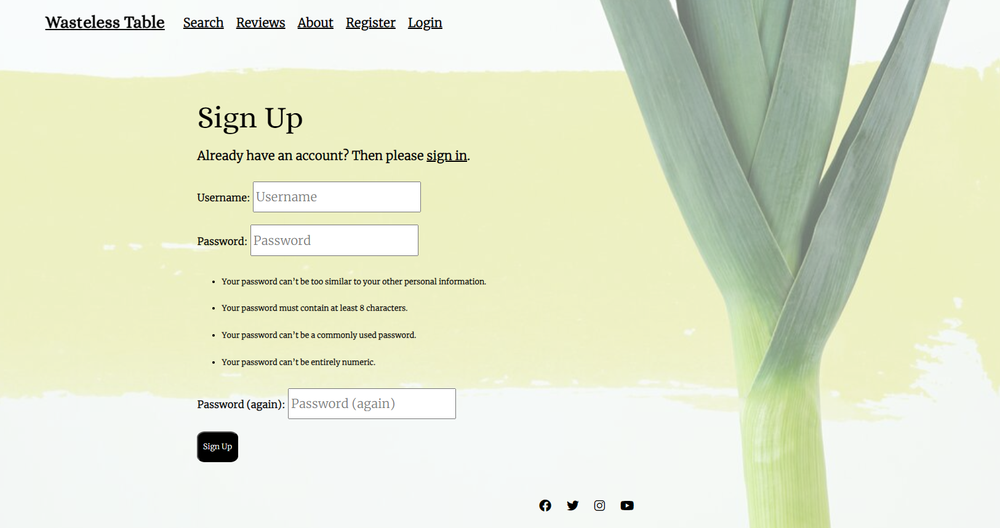

# Wasteless Table: Ingredient Search & Recipe Reviews

Wasteless Table is an online tool and blog that encourages users to avoid discarding food by utilizing what ingredients they already have in the kitchen. A search function provides recipes tailored to what ingredients the user has at hand. Users are invited to join and contribute to a community of people reviewing, sharing and updating recipes.

Live Website here: [Wasteless Table](https://portfolio-project-four-1f2f0bc1d6a0.herokuapp.com/)

## Table of Contents
- [Wasteless Table: Ingredient Search \& Recipe Reviews](#wasteless-table-ingredient-search--recipe-reviews)
  - [Table of Contents](#table-of-contents)
  - [Concept](#concept)
  - [Development](#development)
    - [User Stories](#user-stories)
    - [Wireframes](#wireframes)
    - [Design](#design)
    - [GitHub Projects](#github-projects)
    - [Database and Data Models](#database-and-data-models)
  - [Features](#features)
    - [CRUD Functionality](#crud-functionality)
    - [Authentication and Authorisation](#authentication-and-authorisation)
    - [Navigation](#navigation)
    - [Homepage](#homepage)
    - [Recipe Search](#recipe-search)
    - [Sign up](#sign-up)
    - [Login \& Logout](#login--logout)
    - [Review Blog](#review-blog)
    - [Recipe Post](#recipe-post)
    - [Comments](#comments)
    - [Submit Review](#submit-review)
    - [Update Review](#update-review)
    - [About](#about)
    - [Features Left to Implement](#features-left-to-implement)
  - [Technologies Used](#technologies-used)
    - [Core Development Technologies](#core-development-technologies)
    - [Libraries, Frameworks and Packages](#libraries-frameworks-and-packages)
    - [Python/Django packages](#pythondjango-packages)
    - [Infrastructural Technologies](#infrastructural-technologies)
  - [Testing](#testing)
  - [Deployment](#deployment)
    - [Local Deployment](#local-deployment)
    - [Heroku](#heroku)
    - [Environment Variables](#environment-variables)
  - [Credits](#credits)

## Concept

When researching Application Programming Interfaces (APIs), I chanced upon an interesting Recipe Search API provided by [EDAMAM](https://www.edamam.com/). The provider offers different APIs but the Recipe Search was useful in developing my idea as it could be the basis of where I retrieved recipes from for my blog. If offers 2.3 million different recipes, 500+ web resources and many different types of filters. 

Last September I was staying in a remote guesthouse with very little ingredients and I was wondering what recipes I could make with what little I had. Given the location of the guesthouse, I could not make it to the nearest shop or supermarket. I was reminded of this time when I found the EDAMAM API and read the documentation regarding it's filtering system. It server as the basis of my blog concept. As well as this I have a very bad habit of throwing food away. I do not use things up and often forget I have food stuff lying around - oftentimes I buy an ingredient when I already have some. I've been scolded in the past by this from friends who chastise me for my wastefulness. I decided to combine these general ideas and concepts when considering what I should build for my project.

Ireland is estimated to generate 1.1 million tonnes of food waste per year, according to the [Environmental Protection Agency](https://www.epa.ie/publications/circular-economy/resources/nature-and-extent-update-15th-June.pdf)

## Development

### User Stories

1. As a site user, I can search for so that I can find a recipe to eat.
2. As a site user, I can search with ingredients, tag names or cuisine types so that I can find a list of recipes.
3. As a site user I can see my user profile so that I can see my details.
4. As a site user I can view a list of paginated recipes so that select the recipe details.
5. As a user I can submit recipe reviews so that the admin can add a recipe review to the blog.
6. As a site user I can register an account so that I can leave a comment, rating and like.
7. As a Site User I can click on a recipe so that I can see the details.
8. As a site administrator I can approve posts so that the blog is populated.
9. As a site administrator I can create, read, update and delete so that the blog's content can be managed.
10. As a site administrator I can approve or disapprove comments and recipes so that I can filter content.
11. As a site user and administrator I can view the comments on a recipe so that see what is being talked about.
12. As a site user and administrator I can view the rating and number of likes/upvotes on each recipe so that I can determine the best and popular ones.

User Stories are tested in: [Testing.md](Testing.md)

Link to Projects Board: [Project Board](https://github.com/users/chrisryan91/projects/5/views/1)

### Wireframes

Wireframes were developed at the outset of my project. The general framework for how the website should be structured has remained the same. These served as a basis for my design from the beginning and prevented me from deviating too far in another direction. I created them partly because I understood that could could easily be made responsive to smaller screen sizes with bootstrap.

Search Page Initial Wireframe

 

Search Results Initial Wireframe

 

Submit Review Wireframe

 

Review List Wireframe

 

Recipe Review Wireframe

 

### Design

My design ideas went through two major iterations. Firstly, I chose a colour scheme to carry throughout the website. Towards the end of development the design ideas I had needed to be revised as the website's design had not come out how I envisioned it. I wanted the design to be unobtrusive, calming and easy on the eyes. It needed to be fresh - and I thought what better way to evoke that than fresh vegetables. I found a [background](https://unsplash.com/photos/closeup-photo-of-sliced-spring-onion-KN4ampW-QOI) that was plain but contained the green colours of fresh vegetables. 

Another reason that the design necessitated plainness was that the images returned from the API could be of any colour. Similarly, the images uploaded by users reviewing certain recipes could be of any colour too. This meant that the design of the website should not impede or clash with the returned and uploaded images. For this reason, I kept the main colours of the website white and black. I made the header and footer transparent. I adjusted the opacity of the background image so if black text appeared in-front of shaded parts of the image the text could remain legible.

The two font styles that are carried through the website are [Alice](https://fonts.google.com/specimen/Alice/about) and [Merriweather](https://fonts.google.com/specimen/Merriweather/about). Alice is defined by Google Fonts as "eclectic and quaint, old-fashioned, having widened proportions, open aperture, and soft rounded features; perfect for long meditative text-setting and headlines." I found it to be suitable for headings and titles. Merriweather is a Font I've become accustomed to using over the past few months and considered it appropriate for elements with longer text. I agree with Google when they say it is "a text face that is pleasant to read on screens."

Some text and icons are animated. In-fact there was more JavaScript interactivity and CSS styling in the original iteration of the website but my tutor advise me that I was creating a suboptimal experience by creating too much user friction.

While the [EDAMAM API](https://www.edamam.com/) is a useful tool, it is unable to return the exact steps involved in making the recipe as it did not hold the copyright to the recipes. It returns a lot - labels, images, ingredients, nutritional value - but the exact steps involved in making the recipe were not returned. Given this fact I linked the external URL to the recipe card div which is opened in a new tab. The steps to how the recipes are made are not held on my blog - that is unless a User writing a review wants to include them. Given the fact this blog is focused on ingredients in particular, in my submit review form, there are sections for ingredients and utensils, but not for the exact steps to making the recipe. The blog post is a review - with hints, tips and tricks.

For research, I visited other recipe websites and blogs. Some of them I found very cluttered and while the design was nicely styled there was just too much content on the webpage. There could often be too many links both internally and externally. Given this, I was happy to give all my content the breathing space that it needed. This includes forms. The reviews that are submitted and published are given space when rendered on the HTML page. I just wanted to reviews to speak for themselves as much as possible. I wanted to minimise links and reduce content to a minimum for styling purposes and to reduce user interactions/friction.

### GitHub Projects

The three screenshots below were taken at the start of development, the midway point and at the final stage. They show three columns - to do, in progress and completed. Only over the course of the few weeks developing the project did the lessons on Agile development begin to really make sense. In completing my own project, I recognised mistakes I had made in the planning process and how my development process had to completely change given the timeframe that the project needed to be completed in. The lessons on Agile development - and the entire point of the Agile manifesto - began to really make sense. 

Similarly, at the start of development, I never realised how useful of a tool GitHub projects/views could be.

Initial Agile Screenshot

 

Midway Agile Screenshot

 

Final Agile Screenshot

 

I initially had the prioritisation of what features I needed to implement written down. I was recommended to use GitHub projects for this too so using the User Stories I created a new board to help visualise what did and what did not need to be prioritised. This MoSCoW prioritisation board on GitHub projects was created halfway through the project and not at the beginning.

MoSCoW Prioritisation Screenshot

 

Again, using GitHub projects to help maintain the direction of my project, I created another board with Tasks to help visualise what I needed to do to complete my user stories.

Users & Tasks Screenshots 1

 

Users & Tasks Screenshots 2

 

Users & Tasks Screenshots 3

 

### Database and Data Models

**Review** represents a single recipe review. It's contains all the information for a specific review review on the review blog. It includes information such as:

- id
- title
- url
- slug
- author
- ingredients
- utensils
- updated_on
- content
- featured_image_a
- featured_image_b
- excerpt
- created_on
- cuisine_type
- status
- prep_time
- up_vote
- down_vote

**Ingredient** is a table containing a list of ingredients. It is in a many to many relationship with the review table. It contains a list of ingredients for each of our recipes:

- id
- name

**Utensil** is a table containing a list of utensils. It is in a many to many relationship with with our review table. It contains a list of utensils that can be associated with each review:

- id
- name

**CuisineType** is a table containing different cuisine types. It is in a many to one relationship with out review table. It contains the cuisine type to be associated with each review: 

- id
- name
- slug
  
**Comment** is a table to hold our comments. Each comment is in a one to one relationship with our review table as each comment is associated with one recipe:

- id
- review
- name
- email
- body
- created_on
- approved

Data Model Diagram

 

## Features

### CRUD Functionality

**Create:** Any registered user can leave a review on a recipe provided by the API. A form is rendered on the submit review page to create a recipe review. The form is submitted and before it appears as published, it must be reviewed by the admin to monitor content.

**Read:** Any user of the website irrespective of registration status can read the reviews or comments posted once they have been published by the admin.

**Update:** If the user who wrote a specific post has logged in and is viewing a post they wrote, a button appears with the option to update the form. The clickable link will take them to an update review page with a form rendered allowing them to update their review. Update functionality is not yet available for comments. 

**Delete:** Similarly, if a user who wrote a specific post has logged in and is viewing a post they wrote, a button appears with the option to update the form. The clickable link will take them to an update review page. Alongside a button to update review, there is also a button to delete the post entirely. Delete functionality is extended to comment posts as if a logged in user has written a comment, a button appears to delete the comment.

### Authentication and Authorisation

**Django All Auth** is used for backend authentication

- Users can create an account in the sign-up page.
- Users can sign-in to their account to leave comments, posts and likes using the sign-in page.
- Users can login back into their account using the login page.
- Only authorised users can visit the submit review page and update review page.

### Navigation

The **Navbar** is extended across all pages with base.html using Django templating language. It has a transparent background. On it's left hand side, it contains a title which has an anchor tag linking back to the homepage. Following the title are more links to the other main html pages - Search, Review and About. There is a Login or Register link if the user is not signed in and a Sign Up link if the user is signed in. In response to smaller screen sizes the three link items collapse into a burger icon on the right hand side. Clicking the burger icon will show the four or five links in a drop down menu.

The **Footer** is also carried across all pages. It has a transparent background with four social media icons. These icons serve as anchored links. They remain centre aligned for smaller screen sizes.

Larger Navbar

 

Smaller Navbar

 

Footer

 

### Homepage

The **Homepage** contains the name of the website centrally aligned animated as a welcome. Beneath it are two sections with information about the two main parts of the website - the search function and the review blog. These contain links those pages and a few sentences describing the function of each.

Homepage

 

### Recipe Search

The **Search** page at first contains an introductory animated sentence reminding the user that by searching they're going to come to a decision regarding what they will eat tonight - or what they can make with what is in the fridge. Beneath that is an input form that which select2 targets with JavaScript. This allows the user to type an ingredient, press enter, and that ingredient is turned into a tag. Each ingredient can be entered one by one. Numbers or non-letter characters are not valid. When you search with a list of tags, those tags will be converted into a Comma Separated Value string. If the user types in Ingredients with a space - "Onion Carrot Cheese" - that is also valid. Also, other non-ingredient tags are valid too, such as cuisine types i.e Indian, Chinese.

If the input is valid, the API will return associated recipes which are rendered in the HTML. There are three columns on the page each containing card divisions which hold a specific recipe. The Image and Label are rendered in the HTML. Each recipe has two links - one to an external website containing the full recipe, the other to the submit review page. The values of Image, Label and URL are stored in sessionStorage. The page is paginated at the end meaning more recipes can be viewed on the next page.

Recipe Search

 

Search Results

 

### Sign up

The **sign up page** contains a simple for asking users to Sign Up. There is a link to Sign In if the user already has an account. I removed email authentication deciding it would be a future feature. At present, the form asks for a Username and Password - which needs to be entered twice. This is all that is needed to sign up.

Sign-Up Page

 

### Login & Logout

The **login page** also renders a simple form asking for a Username and Password. 

The **logout page** acts as defensive design asking the users if they are sure they want to sign out. A button is rendered to signout.

Login Page

 

Logout Page

 

### Review Blog

The **Review Blog** contains all the published reviews. In my initial Wireframes, I had the design of the returned search recipes and the recipe blog styled differently. I decided to keep the styling consistent throughout and user the same card container style for the Review Blog. The cards each contain a reviewed recipe submitted and published by the admin. An image is rendered for each recipe in the card with the reviewer (user), upvotes, time since posting and the recipe label. By hovering over the division a link appears to view the full post. The page is paginated towards the end.

Above the cards is a drop down menu where users can choose whether they want to sort the reviews by upvotes or by time created.

Recipe Blog A

 

### Recipe Post

The **Recipe Post** page contains the full recipe review. It is divided into three parts - the information regarding the recipe, the actual review itself and the comment section.

The fields of the Review models are rendered in the first section:

- title
- label
- author
- upvotes
- URL
- ingredients
- utensils
- cuisine type
- featured_image

The upvote feature consists of two icons - a thumbs up and a thumbs down. A registered user has the ability to click to upvote or downvote the review.

Recipe Post 1st Section

 

The second section is the main body of the review itself. It fills up the screen to allow breathing space for the text. Beneath the text is the time and date it was created.

Recipe Post 2nd Section

 

The third section contains the comments. If a user is signed in their username will appear with a text box for inputting a comment with a button to submit.

Recipe Post Third Section

 

### Comments

**Comments** are rendered above the text box. They will not appear unless they are published. A message will appear letting the user know that the comment is pending approval. Once approved the comments are formatted vertically with the latest at the bottom. Each comment contains the username of the author and the date published. Comments can not yet be edited but can be deleted as a delete button appears if the author of the comment wants to remove it from the database.

Added Comment

 

Comments

 

### Submit Review

The **Submit Review** page renders a form for submitting a review. It contains fields to create a new review which will be stored in the Review model. Two specific fields are populated automatically with JavaScript. Values for the review like Label and URL are made read only. The values are stored in sessionStorage from the Search page. We want users to only review recipes that are returned from the API. However, they can be tweaked, so there are fields to enter new ingredients. The fields for ingredients, utensils and cuisine types are targeted by select2 so the values in the database are rendered as tags. A submit button is at the end of the form.

Submit Review

 

If a user is viewing their own post on the recipe blog, they will see an Update Review button rendered beneath the text of the review beside the time created.

Update Button

 

### Update Review

The **Update Review** page renders the same form as the submit review page except the values are already in the input fields. These can be altered, changed or updated. New ingredients can be added or old ones removed. When submitted, the reviews status gets put back to draft, meaning the admin will need to review it before it gets published again. At the bottom of the page alongside the submit button, there is a delete button. This will allow the authenticated user to remove it from the database.

Update Review 1

 

Update Review 2

 

### About

The **About** page consists of information regarding the importance of Ending Food Waste. It contains an animated heading. It ends with a link to donate to [Action Against Hunger](https://www.actionagainsthunger.org/).

About

 

### Features Left to Implement

1. The ability to edit comments has not yet been implemented. I would also like comments to be upvoted and downvote. They could be sorted by upvotes/downvotes like reddit.
   
2. I was in two minds about the feasibility of creating some kind of user dashboard so users could potentially update all their content from the one place. I was not confident that I would get it done on time but it was certainly the next feature I would want to add. At present CRUD operations are present but for a user it would be more manageable to have them in one place.
   
3. Email confirmation in login and sign-up processes. Currently the app only has authentication with username and password. It is good if users would like to maintain their anonymity but negative if the app seeks to foster a community of people talking and chatting. So I need to implement this feature.
   
4. Social Media sign-in. Similarly for the same reason above, social media sign-in would help foster community and also people could share the app with their friends.
   
5. Search feature on the review blog to search for reviews rather than recipes. With so few entries, as the blog gains traction a search feature would need to be implemented to search through the database for reviews.
   
6. On the review submit page, there is no option currently to enter New Utensils or Cuisine Types into the database. Due to the issue documented in the bugs section regarding Select2 targeting those types of elements, typing a csv string is not user friendly. I held off on adapting the code and logic used to enter new values from the form into the database for ingredients or cuisine types until I found either a solution to get Select2 working, or another more user-friendly solution. 
   
There are many features more I would like to implement. Due to the fact this was my first project and there was a deadline, features not implemented was as much a matter of me not being able to find a solution rather than there not being a solution. The more time I got lost researching one issue, the less time I found myself to spend on another issue.

## Technologies Used

### Core Development Technologies

- [Django](https://www.djangoproject.com/) was used a full-stack framework.
- [JavaScript](https://ecma-international.org/publications-and-standards/standards/ecma-262/)
- [jQuery](https://jquery.com/)
- [CSS](https://www.w3.org/Style/CSS/Overview.en.html)
- [HTML](https://html.spec.whatwg.org/multipage/)
- [Django Templating Language](https://docs.djangoproject.com/en/4.2/ref/templates/language/) for building pages

### Libraries, Frameworks and Packages

- [Edamam](https://www.edamam.com/)
- [Bootstrap](https://getbootstrap.com/)
- [Select2](https://select2.org/)

### Python/Django packages

- [Gunicorn](https://pypi.org/project/gunicorn/)
- [psycopg2](https://pypi.org/project/psycopg2/)
- [Coverage](https://pypi.org/project/coverage/)
- [crispy_forms](https://django-crispy-forms.readthedocs.io/en/latest/)
- [django_summernote](https://pypi.org/project/django-summernote/)
  
### Infrastructural Technologies

- [PostgreSQL](https://www.postgresql.org/)
- [Heroku](https://www.heroku.com/home)
- [Cloudinary](https://cloudinary.com/)

## Testing

Full testing: [Testing.md](Testing.md)

## Deployment 

### Local Deployment

1. Find the repository on GitHub.
2. Click the **Code** button and copy the URL.
3. Open the terminal in your IDE and open a session in the directory you want to use.
4. Type "git clone" followed by the URL into the terminal.
5. Type "pip install -r requirements.txt" in the terminal.
6. Set the the correct environment variables in an env.py file.
7. Once connected to your database, run migrations by typing "python manage.py migrate" into the terminal
8. Type "python manage.py createsuperuser" in the terminal and follow the prompts
9. Three .txt files are included to populate the database: ingredients.txt, utensils.txt, cuisine-types.txt.
10. Type "python manage.py runserver" in the terminal and open in browser.

### Heroku 

1. Login to Heroku.
2. Create a new app.
3. Connect to your GitHub repository.
4. In Heroku settings, set up environment variables in the Config Vars section in the settings tab.
5. Click on the deploy tab, and enable automatic deploys from your GitHub repository.
6. Click the "Deploy Branch" button the deploy the app.
7. Once fully deployed, click "Open App".

### Environment Variables

- Create an env.py file for local deployment in the root of the directory of the project.
- Set the environment variables in this file.

In env.py file:
- DATABASE_URL
- CLOUDINARY_URL
- EDA_APP_ID
- EDA_APP_KEY
- SECRET_KEY

In Django settings:
- SECRET_KEY
- DEBUG

- For Heroku deployment, set the environment variables in the Heroku dashboard or the Heroku CLI

## Credits

- This video helped me with testing with Unittest: [Django Testing Tutorial](https://www.youtube.com/watch?v=qwypH3YvMKc&list=PLbpAWbHbi5rMF2j5n6imm0enrSD9eQUaM)
- This video too: [Testing a Django Model](https://www.youtube.com/watch?v=bIFVweK0hMc)
- I got my background image here: [Toa Heftiba, Leek](https://unsplash.com/photos/closeup-photo-of-sliced-spring-onion-KN4ampW-QOI)
- This for CSS div opacity: [CSS Div. Opacity](https://www.w3schools.com/howto/tryit.asp?filename=tryhow_css_image_overlay_opacity)
- This for CSS animations: [22 Useful CSS Tips and Tricks Every Developer Should Know](https://www.makeuseof.com/css-tips-and-tricks-you-must-know/)
- I got my fonts from FontAwesome: [Font Awesome](https://fontawesome.com/)
- My upvote/downvote logic came from Stack Overflow: [Django upvote & downvote system](https://stackoverflow.com/questions/77376229/django-upvote-downvote-system)
- Fonts from Google: [Alice](https://fonts.google.com/specimen/Alice/about) & [Merriweather](https://fonts.google.com/specimen/Merriweather/about)
- dbdiagram was used to make an SQL Database diagram: [dbdiagram](https://dbdiagram.io/)
- Balsamiq was used to create wireframes: [Lucid Chart](https://www.lucidchart.com/pages/)
- Responsively was used to test for responsivity: [Responsively](https://responsively.app/)
- AmIResponsive was used to create the image at the top of this readme: [AmIresponsive?](https://amiresponsive.co.uk/)
- Django Project: [Django Project](https://www.djangoproject.com/start/)
  
On a general basis I don't know how many times I consulted **Stack Overflow** for solutions. If I got an error I didn't understand I was always directed by Google to Stack Overflow.

Similarly, the W3Schools section on Django was a go to in developing my project: [w3schools](https://www.w3schools.com/django/django_templates.php)

- I would like to thank my friend Jonny who helped me with my code despite how messy it got at times. He kept saying: "that's not industry standard."
- I would like to thank my tutor Antonio.
- I would like to thank everyone on the Slack Channel - someone generally always asked the same question I had before me. 

