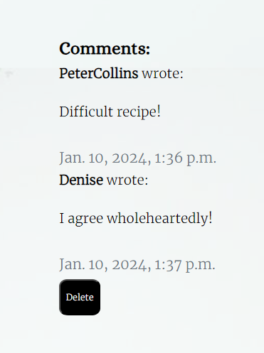
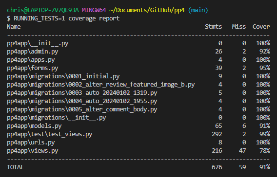

# Full Testing

## Contents
- [Full Testing](#full-testing)
  - [Contents](#contents)
  - [Testing User Stories](#testing-user-stories)
  - [User Story 1](#user-story-1)
  - [User Story 2](#user-story-2)
  - [User Story 3](#user-story-3)
  - [User Story 4](#user-story-4)
  - [User Story 5](#user-story-5)
  - [User Story 6](#user-story-6)
  - [User Story 7](#user-story-7)
  - [User Story 8](#user-story-8)
  - [User Story 9](#user-story-9)
  - [User Story 10](#user-story-10)
  - [User Story 11](#user-story-11)
  - [User Story 12](#user-story-12)
  - [Validator Testing](#validator-testing)
    - [HTML](#html)
    - [CSS](#css)
    - [JavaScript](#javascript)
    - [Python](#python)
    - [Django Extensions](#django-extensions)
  - [Lighthouse Testing](#lighthouse-testing)
  - [Automated Testing](#automated-testing)
  - [Manual Testing](#manual-testing)
    - [Header](#header)
    - [Footer](#footer)
    - [Home Page](#home-page)
    - [Search Page](#search-page)
    - [Submit Review Page](#submit-review-page)
    - [Review List Page](#review-list-page)
    - [Review Post Page](#review-post-page)
    - [Update Review Page](#update-review-page)
    - [About Page](#about-page)
    - [Register Page](#register-page)
    - [Sign-in Page](#sign-in-page)
    - [Logout Page](#logout-page)
  - [Responsiveness Testing](#responsiveness-testing)
    - [Browsers](#browsers)
    - [Devices](#devices)
  - [Bugs](#bugs)
    - [Fixed Bugs](#fixed-bugs)
    - [Known Bugs](#known-bugs)

## Testing User Stories

User Stories were created at the start of my project.

Link to Projects Board: [Project Board](https://github.com/users/chrisryan91/projects/5/views/1)

## User Story 1

- As a site administrator I can create, read, update and delete so that the blog's content can be managed

I copied the Code Institute template and got my environment set up - i.e installing Django - I created a superuser and was able to access admin on my Django project. This allows the admin to perform CRUD functionality.

<details>
<summary>User Story 1</summary>
<br>


</details>

## User Story 2

- As a site user I can use the search the recipe blog so that I can find recipes

After setting up base.html, index.html and search.html, I set up use of EDAMAM API in settings. I had to add some environment variables with my API_KEY and API_ID. Unlike most of my views in views.py, my search view is a function based view. This allowed me to make an API call with an input field in the search page which returned recipes on the same page. I used Django templating language to render the returned recipes. This allows the user to enter a value and receive recipes.

<details>
<summary>User Story 2</summary>
<br>

```
def SubmitReview(request):
    if request.user.is_authenticated:
        if request.method == "POST":
            form = ReviewForm(request.POST, request.FILES)
            if form.is_valid():
                review = form.save(commit=False)
                review.author = request.user
                review.save()
                form.save_m2m()

                existing_ingredients = form.cleaned_data.get('ingredients')
                review.ingredients.set(existing_ingredients)

                new_ingredient_string = form.cleaned_data.get('new_ingredient', '')
                new_ingredient_list = [
                    ingredient.strip()
                    for ingredient in new_ingredient_string.split(',')]

                for new_ingredient_name in new_ingredient_list:
                    try:
                        new_ingredient, created = Ingredient.objects.get_or_create(
                            name=new_ingredient_name)
                        review.ingredients.add(new_ingredient)
                    except IntegrityError:
                        try:
                            new_ingredient = Ingredient.objects.get(
                                name=new_ingredient_name)
                        except Ingredient.DoesNotExist:
                            new_ingredient_id = Ingredient.objects.latest(
                                'id').id + 1
                            new_ingredient = Ingredient.objects.create(
                                id=new_ingredient_id, name=new_ingredient_name)
                        review.ingredients.add(new_ingredient)

                if review.featured_image_a:
                    print(f"Cloudinary URL: {review.featured_image_a.url}")
                else:
                    print("No Cloudinary URL available (featured_image_a is None)")

                url = form.cleaned_data.get("url")
                if url:
                    request.session["modalURL"] = url
                    print(f"Session modalURL set to: {url}")

                return redirect('review_blog')
            else:
                print(form.errors)
        else:
            form = ReviewForm()
            print(form.errors)

        return render(request, 'submit_review.html', {
            'form': form,
            'ingredients': Ingredient.objects.all(),
            'utensils': Utensil.objects.all()})
    
    else:
        return redirect('login')
```
</details>

## User Story 3

- As a user I can search with ingredients, tag names or cuisine type so that I can see a list of recipes.
  
To make an API call I needed to input a string of comma separated values. This was not user friendly. I wanted users to be able to search with tags with ingredients or cuisine types. I found [select2](https://select2.org/) which "gives you a customizable select box with support for searching, tagging, remote data sets, infinite scrolling, and many other highly used options." It allowed for users to enter single ingredients or other tags which could be converted into a comma separated string to make the API call. This allows the user to search by ingredient or other tag names.


<details>
<summary>User Story 3 JavaScript</summary>
<br>

```
$(document).ready(function () {
    $('#id_ingredients').select2();

    $('#id_utensils').select2();

    $('#id_cuisine_type').select2();
});
```
</details>

<details>
<summary>User Story 3 JavaScript</summary>
<br>

```
$(document).ready(function () {
    $('#id_ingredients').select2();

    $('#id_utensils').select2();

    $('#id_cuisine_type').select2();
});

$(document).ready(function() {
    $('#ingredientInput').select2({
        tags: true,
        tokenSeparators: [','],
        placeholder: 'Enter ingredients',
    });

    $('form').submit(function() {
        var selectedIngredients = $('#ingredientInput').val();
        $('#ingredientQuery').val(selectedIngredients.join(','));
    });
})
```
</details>

<details>
<summary>User Story 3 View</summary>
<br>

```
class SearchForm(forms.Form):
    query = forms.CharField(
        validators=[
            RegexValidator(
                regex="^[a-zA-Z, ]+$",
                message="Only letters, commas, and spaces are allowed."
            )]
    )
```
</details>

## User Story 4

- As a site user I can view a list of paginated recipes so that select the recipe details

I looked for different methods of displaying recipes in repeating card. I was going to go ahead and use infinite scroll but because I had experience using pagination I decided to use Django pagination in order to create an end to the amount of rows on each html page before the user is prompted to click "next". This would create a "next" page, "last" page, "previous" page and "first" page rendered after a specific amount of recipes are rendered. This allows the user to click through pages.


<details>
<summary>User Story 4</summary>
<br>

```        

        <nav aria-label="Page navigation" class="pag-nav">
            <ul class="pagination justify-content-center">
                
                <li><a href="?page={{ page_obj.previous_page_number }}" class="page-link">&laquo; PREV</a></li>
                
                
                <li><a href="?page={{ page_obj.next_page_number }}" class="page-link">NEXT &raquo;</a></li>
                
            </ul>
        </nav>
        
```
</details>

## User Story 5

- As a Site User I can click on a recipe so that I can see the details.

For this I needed to create a link one each of the card divisions with a link to the URL. When the user hovers over the div two icons appear with anchor links - to the URL to see the details and to Submit Review. This allows the user to see the details of the specific recipe.

<details>
<summary>User Story 5</summary>
<br>


</details>

## User Story 6

- As a site administrator I can approve or disapprove comments and recipes so that I can filter content

In admin.py, I was able to import the Comment model and all of it's fields. One of this is Approved. Approved is a Boolean value initially set to False. One of the "actions" defined in admin.py is "approve_comments". This allows the administration to approve comments and recipes so content can be filtered.

<details>
<summary>User Story 6</summary>
<br>

```
class Comment(models.Model):
    approved = models.BooleanField(default=False)
```
</details>

<details>
<summary>User Story 6</summary>
<br>

```
@admin.register(Comment)
class CommentAdmin(admin.ModelAdmin):
    list_display = ('name', 'body', 'created_on', 'approved', 'review')
    list_filter = ('approved', 'created_on', 'review')
    search_fields = ('name', 'address', 'body')
    actions = ['approve_comments']

    def approve_comments(self, request, queryset):
        queryset.update(approved=True)
```
</details>

## User Story 7

- As a site user I can see my user profile so that I can see my details

This user story was never completed as intended. Initially I wanted to have a user profile dashboard to achieve CRUD functionality. Rather than that, users are given the option to perform CRUD operations on their own posts on the review blog.

## User Story 8

- As a site user I can register an account so that I can leave a comment, rating and like

I used [Django All Auth](https://docs.allauth.org/en/latest/) to authenticate users. There is a signup, login and logout pages with forms to handle entry of user details. Only authenticated users can comment, upvote and leave a review so this gives users the ability to register.

<details>
<summary>User Story 8 Screenshot</summary>
<bn>


</details>

<details>
<summary>User Story 8 Code</summary>
<br>

```
class CustomSignupView(SignupView):
    template_name = 'account/signup.html'
    form_class = CustomSignupForm

class CustomLoginView(LoginView):
    template_name = 'account/login.html'
    form_class = CustomLoginForm`
```
</details>


## User Story 9

- As a user I can submit recipe reviews so that I can add a recipe review to the blog

A submit review page is available to only authenticated users where they can fill out a form to submit a review. Again this is handled by a function based view. It has fields that correspond to the Review model. This allows users to submit a review - and if it passes review by the admin it will be published.

<details>
<summary>User Story 9 Screenshot</summary>
<br>


</details>

<details>
<summary>User Story 9 View</summary>
<br>

```
def SubmitReview(request):
    if request.user.is_authenticated:
        if request.method == "POST":
            form = ReviewForm(request.POST, request.FILES)
            if form.is_valid():
                review = form.save(commit=False)
                review.author = request.user
                review.save()
                form.save_m2m()

                existing_ingredients = form.cleaned_data.get('ingredients')
                review.ingredients.set(existing_ingredients)

                new_ingredient_string = form.cleaned_data.get('new_ingredient', '')
                new_ingredient_list = [
                    ingredient.strip()
                    for ingredient in new_ingredient_string.split(',')]

                for new_ingredient_name in new_ingredient_list:
                    try:
                        new_ingredient, created = Ingredient.objects.get_or_create(
                            name=new_ingredient_name)
                        review.ingredients.add(new_ingredient)
                    except IntegrityError:
                        try:
                            new_ingredient = Ingredient.objects.get(
                                name=new_ingredient_name)
                        except Ingredient.DoesNotExist:
                            new_ingredient_id = Ingredient.objects.latest(
                                'id').id + 1
                            new_ingredient = Ingredient.objects.create(
                                id=new_ingredient_id, name=new_ingredient_name)
                        review.ingredients.add(new_ingredient)

                if review.featured_image_a:
                    print(f"Cloudinary URL: {review.featured_image_a.url}")
                else:
                    print("No Cloudinary URL available (featured_image_a is None)")

                url = form.cleaned_data.get("url")
                if url:
                    request.session["modalURL"] = url
                    print(f"Session modalURL set to: {url}")

                return redirect('review_blog')
            else:
                print(form.errors)
        else:
            form = ReviewForm()
            print(form.errors)

        return render(request, 'submit_review.html', {
            'form': form,
            'ingredients': Ingredient.objects.all(),
            'utensils': Utensil.objects.all()})
    
    else:
        return redirect('login')
```
</details>

## User Story 10

- As a site user and administrator I can view the comments on a recipe so that see what is being talked about

Comments are rendered in the html page underneath the review itself. They can be managed by the administrator in the admin section. If a user is authenticated, they can respond to a comment. If a user is authenticated and the author of a comment, they can delete the comment. This allows the users and admins to view comments and see what is being talked about.

<details>
<summary>User Story 10 Screenshot</summary>
<br>


</details>

## User Story 11

- As a administrator I can approve posts so that the blog is populated

Similarly to the comment approval User Story above, our Review class has a status model. This is initially set to 0. In the admin section, the administrator can review posts and publish them to the blog with this feature. By setting the "STATUS" to "1" to indicate "Published" allowing the blog to be populate.

<details>
<summary>User Story 11</summary>
<br>

```
STATUS = ((0, "DRAFT"), (1, "Published"))
```
</details>

<details>
<summary>User Story 11 Review Status</summary>
<br>

```
class Review(models.Model):
    status = models.IntegerField(choices=STATUS, default=0)
```
</details>

## User Story 12

- As a site user and administrator I can view the rating and number of likes on each recipe so that I can determine the best and popular ones

I first created two icons - a thumbs up and a thumbs down icon - to signify upvotes. Two forms needed to be added to each icon - and two buttons on each form. Four buttons altogether - one if they have upvoted, one if they have not upvoted, one if they have downvoted, one if they have not downvoted. If the user has upvoted, they can downvote, but the upvote has to be removed. If the user has downvoted, they can upvote, the downvote has to be removed. A class is attached to change the colour of the icon depending on the users choice.

I attached the template and the logic below. This became a bug for me. It is documented in the bugs section. I luckily found a solution on [Stack Overflow](https://stackoverflow.com/questions/77376229/django-upvote-downvote-system)

<details>
<summary>User Story 12 Upvote Screenshot</summary>
<br>


</details>

<details>
<summary>User Story 12 Template</summary>
<br>

```
    
        <form class="d-inline" action="" method="POST">
            
            <input type="hidden" name="vote_type" value="upvote">
            
            <button type="submit" name="review_id" value="{{ review.slug }}" class="btn-like">
                    <i class="far fa-thumbs-up upvoted"></i>
            </button>
                
            <button type="submit" name="review_id" value="{{ review.slug }}" class="btn-like">
                    <i class="far fa-thumbs-up"></i>
            </button>
                
        </form>
        <form class="d-inline" action="" method="POST">
            
            <input type="hidden" name="vote_type" value="downvote">
                
                <button type="submit" name="blog_id" value="{{ review.slug }}" id="btn-like" class="btn-like">
                    <i class="far fa-thumbs-down downvoted"></i>
                </button>
                
                <button type="submit" name="blog_id" value="{{ review.slug }}" id="btn-like" class="btn-like">
                    <i class="far fa-thumbs-down"></i>
                </button>
                
        </form>
    
        <i class="fas fa-thumbs-up"></i>
        <i class="fas fa-thumbs-down"></i>
    
```
</details>

<details>
<summary>User Story 12 Logic</summary>
<br>


```
class ReviewUpvote(View):
    def post(self, request, slug):
        review = get_object_or_404(Review, slug=slug)

        vote_type = request.POST.get('vote_type', None)
        if vote_type == 'upvote':
            review.up_vote.filter(id=request.user.id).exists() is False \
                and review.up_vote.add(request.user)
            review.down_vote.filter(id=request.user.id).exists() \
                and review.down_vote.remove(request.user)

        elif vote_type == 'downvote':
            review.down_vote.filter(id=request.user.id).exists() \
                is False and review.down_vote.add(request.user)
            review.up_vote.filter(id=request.user.id).exists() \
                and review.up_vote.remove(request.user)

        generated_url = reverse('review_post', args=[slug])
        print("Generated URL:", generated_url)

        return HttpResponseRedirect(reverse('review_post', args=[slug]))
```
</details>

## Validator Testing

### HTML

- The signup page that is part of Django templates rendered a few issues in the HTML checker as seen below. As they were not my own, I decided against creating a custom form as the current one works fine. The errors remain.

- Other than the signup page, no issues were found in the HTML.

<details>
<summary>Sign-Up Page W3 HTML Checker</summary>
<br>


</details>

<details>
<summary>HTML Validation</summary>
<br>


</details>

### CSS

I have one single CSS file for the application. It passes through W3S CSS validator.

<details>
<summary>CSS Validation</summary>
<br>


</details>

### JavaScript

There is one single JavaScript file in this project. It passes JSHint. 

<details>
<summary>JavaScript Validation</summary>
<br>


</details>

### Python

All my python files are PEP8 compliant. For this, I used the Code Institute Linter. They all passed with no issues. For example:

<details>
<summary>admin.py</summary>
<br>


</details>

<details>
<summary>forms.py</summary>
<br>


</details>

<details>
<summary>models.py</summary>
<br>


</details>

<details>
<summary>urls.py</summary>
<br>


</details>

<details>
<summary>views.py</summary>
<br>


</details>

### Django Extensions

I installed [Django Extensions](https://github.com/django-extensions/django-extensions) to see if there were errors with the code in my templates. None were found.

<details>
<summary>Django Template Validation</summary>
<br>


</details>

## Lighthouse Testing


## Automated Testing

Automated Testing was carried out using Django testing tool. I tested after my code was written. I only have one main app for my project to achieve greater than 90% coverage I just needed to test four files:

- test_admin.py
- test_forms.py
- test_models.py
- test_views.py

My test_views was by far the biggest. I came upon a few errors and bugs in the process of testing my views. One bug in particular - regarding Django's message tool - caused a lot of problems which is why my views.py testing covers only 78%. With a deadline approaching I had to focus on other elements of the project. I have covered this issue in the bug section.

<details>
<summary>Coverage Report</summary>
<br>


</details>

## Manual Testing

### Header

| Element | Action | Expectation | Result|
|---------|--------|-------------|-------|
| Site Name| Click | Return to homepage | Working |
| Site Name| Hover | Cursor changes | Working |
| Search Link | Click | Directs to Search | Working |
| Search Link | Hover | Icon Wobbles | Working |
| Search Link | Hover | Cursor changes | Working |
| Reviews Link | Click | Directs to Reviews Blog page | Working |
| Reviews Link | Hover | Icon Wobbles | Working |
| Reviews Link | Hover | Cursor changes | Working |
| About Link | Click | Directs to About page | Working |
| About Link | Hover | Icon Wobbles | Working |
| About Link | Hover | Cursor changes | Working |

If not logged in:

| Element | Action | Expectation | Result|
|---------|--------|-------------|-------|
| Register Link | Click | Directs to Register page | Working |
| Register Link | Hover | Icon Wobbles | Working |
| Register Link | Hover | Cursor changes | Works|
| Login Link | Click | Directs to Login page | Working |
| Login Link | Hover | Icon Wobbles | Working |
| Login Link | Hover | Cursor changes | Working |

If logged in:

| Element | Action | Expectation | Result|
|---------|--------|-------------|-------|
| Logout Link | Click | Directs to Logout page | Working |
| Logout Link | Hover | Icon Wobbles | Working |
| Logout Link | Hover | Cursor changes | Working |

### Footer

| Element | Action | Expectation | Result|
|---------|--------|-------------|-------|
| Facebook Link | Click | Facebook opens in new tab | Working |
| Facebook Link | Hover | Icon Wobbles | Working |
| Facebook Link | Hover | Cursor changes | Working |
| Twitter Link | Click | Twitter opens in new tab | Working |
| Twitter Link | Hover | Icon Wobbles | Working |
| Twitter Link | Hover | Cursor changes | Working |
| Instagram Link | Click | Instagram opens in new tab | Working |
| Instagram Link | Hover | Icon Wobbles | Working  |
| Instagram Link | Hover | Cursor changes | Working |
| YouTube Link | Click | YouTube opens in new tab | Working |
| YouTube Link | Hover | Icon Wobbles | Working |
| YouTube Link | Hover | Cursor changes | Working |

### Home Page

| Element | Action | Expectation | Result|
|---------|--------|-------------|-------|
| Search Link | Click | Directs to Search page | Working |
| Search Link | Hover | Cursor changes | Working |
| View Blog Link | Click | Directs to Reviews Blog | Working |
| View Blog Link | Hover | Cursor changes | Working |

### Search Page

| Element | Action | Expectation | Result|
|---------|--------|-------------|-------|
| Form Input | Enter Ingredient | Select2 targets the element and saves it in a tag | Working |
| Form Button | Enter anything other than a string with letters | Invalid data message | Working |
| Form Button | Click Search with valid entry | Tags get converted to CSV string and returns recipes | Working |
| Form Button | Click Search with data with no results | "No results" renders in template | Working |

| Element | Action | Expectation | Result|
|---------|--------|-------------|-------|
| Card .Div. | Hover | Div. appears with anchored icon | Working |
| Card Div. Icon | Hover | Text appears with external link to review | Working |
| Card Div. Icon | Click | New tab opens with link to recipe | Working |
| Card Div. Icon | Hover | URL, Label, Image stores in sessionStorage | Working |

| Element | Action | Expectation | Result|
|---------|--------|-------------|-------|
| Next Link | Click | Directs to Next page | Working |
| Last Link | Click | Directs to Last page | Working |

If logged in:

| Element | Action | Expectation | Result|
|---------|--------|-------------|-------|
| Card Div. | Hover | Div. appears with second anchored icon | Working |
| Card Div. Icon | Hover | Text appears with internal link to review recipe | Working |
| Card Div. Icon | Click | Redirect to submit review page | Working |

### Submit Review Page

| Element | Action | Expectation | Result|
|---------|--------|-------------|-------|
| Title Input | Type/Click | Title will function | Working |
| Recipe Input | Type/Click | Not working - readme only | Working |
| Review Input | Type/Click | Review content appears | Working |
| URL Input | Type/Click | Not working - readme only | Working |
| Cuisine Type Input | Type/Click | Select 2 targets element, creates tags to choose from database | Working |
| Ingredients Input | Type/Click | Select 2 targets element, creates tags to choose from | Working |
| Utensils Input | Type/Click | Select 2 targets element, creates tags to choose from | Working |
| Cloudinary Input | Click choose file | File Explored box pops up to choose image | Working |
| Prep Time Input | Type | Text box appears only allowing numbers | Working |
| New Ingredient Input | Type | Text box appears | Working |

On Submit:

| Element | Action | Expectation | Result|
|---------|--------|-------------|-------|
| Cuisine Type Input | Enter Two Values | Valid | Working |
| Ingredients Input | Enter no values | Invalid | Working |
| Utensils Input | Enter no values | Invalid | Working |
| Cloudinary Input | Enter no image | Valid | Working |
| Prep Time Input | Type | Enter no value | Working |
| New Ingredient Input | Enter CSV string | valid | Working |
| New Utensil Input | Enter CSV string | Valid | Working |

### Review List Page

| Element | Action | Expectation | Result|
|---------|--------|-------------|-------|
| Sort-By Dropdown | Click | Drop down appears with two values: latest and upvotes | Working |
| Sort-By Button | Click | Card Div. sort themselves correctly | Working |
| Review Card Div. | Hover | Div. wi.th Icon Appears in Centre | Working |
| Review Card Div. Icon | Hover | "Visit Review" text appears | Working |
| Next Link | Click | Directs to Next page | Working |
| Last Link | Click | Directs to Last page | Working |

### Review Post Page

| Element | Action | Expectation | Result|
|---------|--------|-------------|-------|
| External Recipe Link | Click | New tab opens with recipe | Working |

If logged in:

| Element | Action | Expectation | Result|
|---------|--------|-------------|-------|
| Upvote | Hover | Icon Wobbles | Working |
| Upvote | Click | Colour Changes, total upvotes increases correctly | Working |
| Downvote | Hover | Icon Wobbles | Working |
| Downvote | Click | Colour Changes, total upvotes decreases correctly | Working |
| Comment Textbox | Click/Type | Textbox size can be increased and written in | Working |
| Comment Submit Button | Click | In text is in the box, valid - otherwise, not valid | Working |

If logged in user in Review author:

| Element | Action | Expectation | Result|
|---------|--------|-------------|-------|
| Update Review Link | Click | Page redirects to a new form | Working |

### Update Review Page

| Element | Action | Expectation | Result|
|---------|--------|-------------|-------|
| Title Input | Type/Click | Text can be updated | Working |
| Recipe Input | Type/Click | Not working - readme only | Working |
| Review Input | Type/Click | Text can be updated | Working |
| URL Input | Type/Click | Not working - readme only | Working |
| Cuisine Type Input | Type/Click | Select 2 targets element, creates tags to choose from database, tags can be deleted | Working |
| Ingredients Input | Type/Click | Select 2 targets element, creates tags to choose from, tags can be deleted | Working |
| Utensils Input | Type/Click | Select 2 targets element, creates tags to choose from, tags can be deleted | Working |
| Cloudinary Input | Click choose file | File Explored box pops up to choose image, old image can be cleared | Working |
| Prep Time Input | Type | Text box appears only allowing numbers | Working |
| New Ingredient Input | Type | Text box appears | Working |

On Submit:

| Element | Action | Expectation | Result|
|---------|--------|-------------|-------|
| Cuisine Type Input | Enter Two Values | Valid | Working |
| Ingredients Input | Enter no values | Invalid | Working |
| Utensils Input | Enter no values | Invalid | Working |
| Cloudinary Input | Enter no image | Valid | Working |
| Prep Time Input | Type | Enter no value | Working |
| New Ingredient Input | Enter CSV string | valid | Working |
| New Utensil Input | Enter CSV string | Valid | Working | 

### About Page

| Element | Action | Expectation | Result|
|---------|--------|-------------|-------|
| External links | Click | New tab opens with correct link | Working |

### Register Page

| Element | Action | Expectation | Result|
|---------|--------|-------------|-------|
| Sign in link | Click | Page redirects to login page | Working |

On submit:

| Element | Action | Expectation | Result|
|---------|--------|-------------|-------|
| Name input | Type Name that already exists | Invalid - notification appears appears | Working |
| Name input | Type Name that doesn't exists | Valid | Working |
| Password input | Password Contains Name | Invalid - notification appears appears | Working |
| Password input | Password Doesn't Contains Name | Valid | Working |
| Password input | Paste password into input field | Invalid | Working |
| Email input | No input | Valid | Works|
| Email input | Text but not an email address | Not valid - needs @ | Working |
| Email input | Enter email | Valid | Working |
| Sign-up button | Click | Valid | Working |

### Sign-in Page

| Element | Action | Expectation | Result|
|---------|--------|-------------|-------|
| Name Input & Password Input | type | Values appear | Working |
| Remember Me Checkbox | Click | Checkbox ticks | Working |
| Sign In Button | Click with valid data| Logs in | Working |
| Sign In Button | Click with invalid data| Message is rendered in html | Working |

### Logout Page

| Element | Action | Expectation | Result|
|---------|--------|-------------|-------|
| Logout Button | Click | Logs out | Working |

## Responsiveness Testing

I tested the APP throughout the development with Dev Tools. Towards the end of development I paid more attention to it and tested my app on different devices. I sent the live link to friends of mine and I watched them use it. The app functioned correctly on all of these devices.

### Browsers 
- Chrome
- Opera
- Bing
- Safari

### Devices
- Lenovo Laptop
- Mac Desktop
- Samsung Phone
- iPhone
- Huawei i7

<details>
<summary>iPad</summary>
<br>


</details>

<details>
<summary>iPhone 12 Pro</summary>
<br>


</details>

<details>
<summary>MacBook Pro</summary>
<br>


</details>

## Bugs

### Fixed Bugs

- **Placeholder Image**

At the moment if a user does not upload an image when reviewing a recipe, a placeholder image is used. This placeholder is the same for all recipes. In the initial stages of design, I wanted to use the image that was returned by the API as a placeholder image, as this image has direct relevance to the recipe in question. Currently, the blog placeholder image is a generic image. 

The API call returned a URL to an image link. This worked and the image rendered correctly on the page. After an hour or so however, the URL ceased to function. The API generated a URL to the image link that timed out after that period. This was less of a fix rather than second best option.

- **Upvote and Downvote**

My initial code for upvote and downvote logic became unwieldy. I could get users to upvote and downvote but I couldn't get total upvotes to work properly.

In my model for my reviews, I originally just had one field called **upvotes**. This I would increase or decrease based on users actions. This was the root of my problem. My review model needed an upvote field to count upvotes and a downvote field to count downvotes. The I would defined a separate function within the model class which works out the total upvotes.

I found the solution to my problem on [Stack Overflow](https://stackoverflow.com/questions/77376229/django-upvote-downvote-system).

- **URL Configuration**

At some points throughout creating the project my URLs were not configured properly. They needed to be changed and the order of the needed to be changed. I used Stack Overflow for solutions regarding this: [Django URLs randomly shows ImproperlyConfigured](https://stackoverflow.com/questions/48237188/django-urls-randomly-shows-improperlyconfigured)

### Known Bugs

- **Bugs regarding messages**

I couldn't get messaging to work properly on this app. I had experience adding messages to Django settings and utilizing bootstrap to make messages show up. I revisited a walkthrough project I had completed and was able the get some of them working - sign in and signed out in particular. However, other messages, such as "Form Completed", "Submission Accepted" or "this field is required" would not work correctly. In the image below, you see an error message that displayed if a value other than a string was entered into the search input the make an API call. It functioned initially but the problem I had was that it would return every time I revisited the search page. I removed it and consider this a feature I need to work on.

Similarly, when I created some tests for some of the messages, the tests were running an error informing me that I had not installed Messages in the middleware section of my settings.py file. That did not make sense to me and I did not have time to fix this bug. The messages that are affected by this bug have been removed on submission.

<details>
<summary>Middleware Testing Bug</summary>
<br>


</details> 

<details>
<summary>Middleware Testing Bug</summary>
<br>


</details>

- **Sorting and Pagination** 

In the final testing stage of development I realised that there is an issue with how pagination works with the sorting feature on the blog page. The page paginates correctly and also sorts itself but number of upvotes. However, I think that when you sort by upvotes, then click onto the next page, the sorting reverses itself and doesn't continue onto the next page. This means that the sorting method only works for the blog posts on the first page.

- **Select2 on New Ingredient Field**

The Select2 library that works to make the input fields more dynamic on the ingredient input field in the Search page and the ingredient, utensil and cuisine type field on the submit review page would not work on the new ingredient field. Like the search input, the new ingredient field needs a csv input. I was able to get this working for the search input, but I could not get it working for the new ingredient field.

My form for the search field was a simple select field that I was easily able to target with CSS and JavaScript. The enter new ingredient form field was an input field - not a select field - and I could not easily change it because some form elements were automatically rendered by Django. Select2 would not as easily work on an input field of that sort.

Currently, the field works, but it is not user friendly, and for multiple ingredients to be entered they needed to be comma separated.